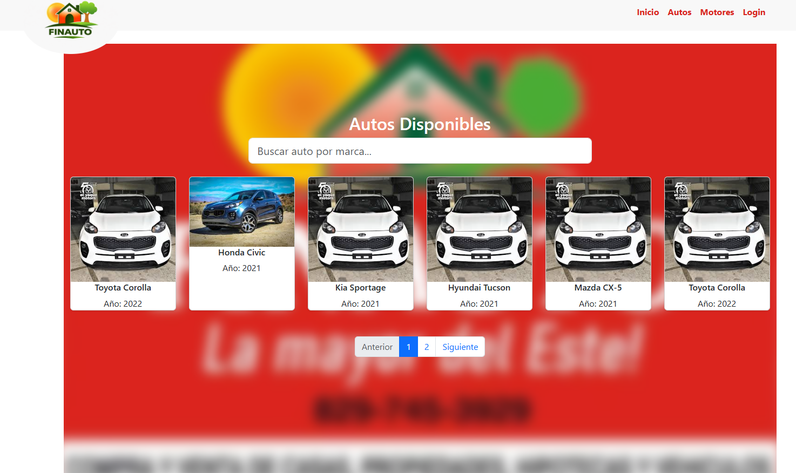
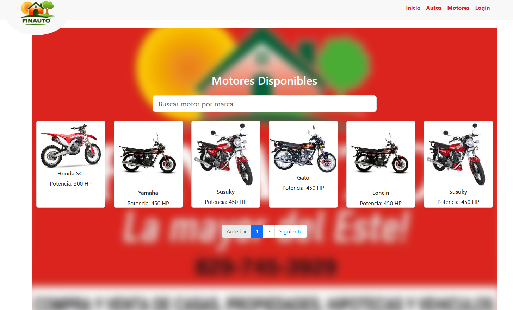

# 🚗 Finauto – Plataforma Web de Venta de Autos

Finauto es una aplicación web moderna para la **gestión y visualización de autos y servicios automotrices**, que cuenta con un **sitio público** para clientes y un **panel administrativo (dashboard)** para la gestión de contenido.

El proyecto está desarrollado con **React + Vite**, utiliza **React Router** para la navegación y **Bootstrap 5** para el diseño responsivo.

---








## 📌 Características principales

### 🌐 Sitio público
- Página de inicio con **Hero dinámico**
- Listado de autos
- Sección de motores
- Servicios destacados
- Testimonios en formato **slider**
- Diseño totalmente **responsive**
- Navbar y footer globales

### 🔐 Panel Administrativo
- Login de administrador
- Dashboard con sidebar colapsable
- Gestión de:
  - Hero (slider principal)
  - Autos
  - Motores
  - Servicios
  - Testimonios
  - Usuarios
- Tablas adaptadas a dispositivos móviles
- Modales para crear y editar contenido

---

## 🧱 Tecnologías utilizadas

- ⚛️ **React 18**
- ⚡ **Vite**
- 🚦 **React Router DOM**
- 🎨 **Bootstrap 5**
- 📦 CSS personalizado
- 🧩 Componentes reutilizables
- 🧭 Layouts (PublicLayout / AdminLayout)

---

## 📁 Estructura del proyecto


---

## 🚦 Rutas principales

### Públicas
- `/` → Inicio
- `/cars` → Autos
- `/cars/id` → Auto
- `/motors` → Motores
- `/motors/id` → Motor
- `/login` → Login admin

### Administrativas
- `/admin` → Dashboard
- `/admin/hero`
- `/admin/cars`
- `/admin/motors`
- `/admin/services`
- `/admin/testimonials`
- `/admin/users`

---

## 📱 Responsive Design

- Sidebar del dashboard se **oculta en móviles**
- Navbar con botón hamburguesa
- Tablas adaptadas con scroll horizontal
- Cards y sliders ajustables a cualquier pantalla

---

## ⚙️ Instalación y ejecución

```bash
# Clonar repositorio
git clone https://github.com/tu-usuario/finauto.git

# Entrar al proyecto
cd finauto

# Instalar dependencias
npm install

# Ejecutar en desarrollo
npm run dev
